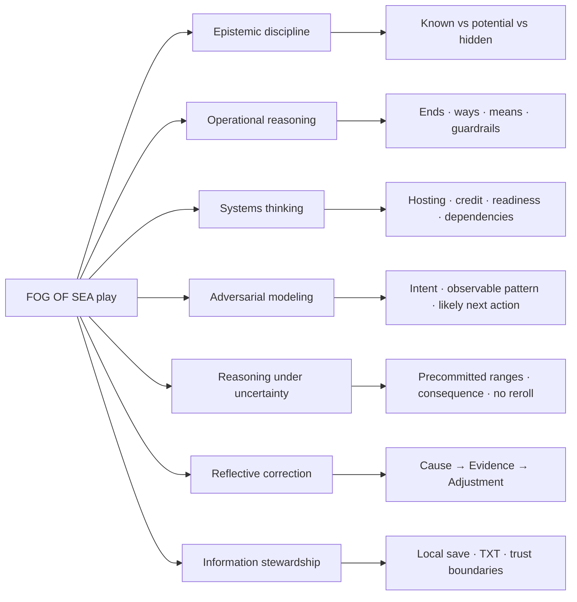

# 06 — Personas and Journey Maps

These are hypothesis personas for design and research, not demographic claims. One person may occupy several modes in one session.

## Persona 1 — The cozy-curious strategy learner

**Goal:** experience a beautiful world and learn how strategic choices connect.  
**Context:** limited wargame vocabulary; may arrive for the visual atmosphere.  
**Needs:** plain language, a clear next step, reversible experimentation, dignity after mistakes.  
**Risk:** becomes overwhelmed by terms, catalogs, or multiple panels.

| Stage | Action / thought | Emotion | Friction | Design response | Success evidence |
| --- | --- | --- | --- | --- | --- |
| Entry | “Can I try this without an account?” | Cautious | Privacy vocabulary | Equal session-only choice, short disclosure | Accurately explains what is stored |
| Mission | Reads conditions and rotates scene | Curious/awe | Brief density | Summary pairs, expandable sections, Guided checklist | Names mission and one condition |
| Strategy | Chooses end state and theories | Tentative ownership | Unfamiliar concepts | Ordered selects, notes, Field Guide | Explains one causal mechanism |
| Force | Builds a legal force | Productive frustration | Hosting/credit difference | Local compatibility feedback | Reaches legal force without moderator |
| Command | Resolves turns and undoes one | Tense but safe | Probability language | Ranges + no-reroll explanation | Predicts one tradeoff |
| Debrief | Opens a related lesson | Reflective | Score fixation | Cause/evidence/adjustment first | States a feasible change |

## Persona 2 — The experienced strategy gamer

**Goal:** test system depth, alternate plans, and deterministic consequences.  
**Context:** comfortable with dense interfaces and optimization.  
**Needs:** inspectable rules, fast navigation, scenario variation, no arbitrary rerolls.  
**Risk:** treats score as the whole game or assumes copied real-world doctrine.

| Stage | Action / thought | Emotion | Friction | Design response | Success evidence |
| --- | --- | --- | --- | --- | --- |
| Entry | Selects Challenge and session mode | Ready | Intro feels slow | Keyboard-first gate, saved preference where allowed | Starts without bypassing disclosure |
| Scenario | Audits matrix, environment, actors | Analytical | Wants internal detail | Disclosed ranges and fictional boundary | Can state what remains concealed |
| Force | Tests substitutions and edge cases | Competitive curiosity | Credit rules may surprise | Exact capacity/reach/tracking explanations | Predicts credited points |
| Command | Replays same turn/order | Skeptical then trusting | Expects fresh roll | Deterministic replay and timeline commitment | Confirms identical result |
| Debrief | Compares component scores | Investigative | May ignore narrative aim | Thresholds tied to political aim/guardrail | Proposes a different mechanism, not only higher score |
| Return | Retries same scenario | Mastery | Re-entry cost | Preserve scenario, concise planning recap | Completes comparative run |

## Persona 3 — The educator or facilitator

**Goal:** use the simulation to prompt discussion about ends, ways, means, uncertainty, and evidence.  
**Context:** small class, seminar, or individual assignment; may not control participant devices.  
**Needs:** bounded claims, reproducibility, exportable records, discussion prompts, privacy clarity.  
**Risk:** overinterprets one play or collects participant data casually.

| Stage | Action / thought | Emotion | Friction | Design response | Success evidence |
| --- | --- | --- | --- | --- | --- |
| Preparation | Reviews Field Guide, Academy, evidence limits | Responsible | Content breadth | Documentation index and lesson paths | Selects objectives and limitations |
| Setup | Assigns session-only mode and contrasting profiles | Organized | Different devices | Local static build and no account | All participants start consistently |
| Facilitation | Observes reasoning before readiness reveal | Curious | Score can dominate | Playtest protocol and unscored writing | Captures explanation, not just result |
| Comparison | Uses same scenario retry | Analytical | Need reproducibility | Exact deterministic rules and TXT record | Compares plans against same commitments |
| Debrief | Uses timeline and Academy prompt | Reflective | False generalization | Evidence-limit language and causal findings | Participants state bounded insights |
| Follow-up | Keeps anonymous local notes | Careful | Privacy handling | No telemetry; explicit local record policy | No identifying data enters app/archive |

## Persona 4 — The accessibility-first player

**Goal:** complete the full game using keyboard, assistive technology, magnification, reduced motion, or forced colors.  
**Context:** visual canvas may be secondary or unavailable.  
**Needs:** semantic equivalents, stable focus, restrained announcements, reflow, no color-only state.  
**Risk:** becomes trapped in overlays or loses context after phase changes.

| Stage | Action / thought | Emotion | Friction | Design response | Success evidence |
| --- | --- | --- | --- | --- | --- |
| Entry | Tabs through privacy choices | Evaluating trust | Modal complexity | Named dialog, contained focus | Starts without focus loss |
| Planning | Uses skip link and native controls | Oriented | Dense brief | Named regions, term/value pairs | Finds current decision quickly |
| Visualization | Changes layers using buttons | Included | Canvas gestures | Text alternative + labelled controls | Identifies current layer and conditions |
| Command | Reviews reports and select notes | Focused | Live-message overload | Ordinary content, concise phase announcement | Completes orders without missed note |
| Debrief | Page-scrolls focusable review | Reflective | Long document | Page/Home/End shortcuts and headings | Reaches findings and actions |
| Overlay return | Closes Academy or Save | Confident | Focus restoration | Opener tracking | Focus returns to expected control |

## Persona 5 — The privacy and security-conscious evaluator

**Goal:** understand exactly what runs, stores, imports, exports, and contacts a network.  
**Context:** inspects headers, storage, dependencies, and portable saves.  
**Needs:** accurate threat model, local-only runtime, explicit limits, verifiable artifacts.  
**Risk:** encoded data is mistaken for encryption or browser saving for secure storage.

| Stage | Action / thought | Emotion | Friction | Design response | Success evidence |
| --- | --- | --- | --- | --- | --- |
| Launch | Reads privacy gate | Skeptical | Product claims | Concrete account/storage/network disclosure | Chooses based on accurate understanding |
| Runtime | Observes local requests | Verifying | Host metadata nuance | Restrictive policy, bundled assets, documented hosting limit | Finds no app telemetry request |
| Save | Enables local slot without prose | Controlled | Policy persistence | Per-slot inclusion rule | Reload preserves exclusion |
| Export | Inspects human and machine sections | Curious | Base64 ambiguity | “Encoding is not encryption” at export | Describes confidentiality correctly |
| Import | Tries malformed/tampered file | Testing | Generic rejection risk | Atomic error, replay validation | Invalid file changes no state |
| Release | Reviews SBOM/licenses/audit | Assured but bounded | Absolute-security language | Evidence and remaining limits | Can name residual risks |

## Persona 6 — The returning systems explorer

**Goal:** maintain several games, compare approaches, and deepen Academy study.  
**Context:** understands core flow; values continuity and quick re-entry.  
**Needs:** named slots, preserved stage, compact recap, reliable TXT portability.  
**Risk:** loads the wrong slot, overwrites prose policy, or forgets what changed.

| Stage | Action / thought | Emotion | Friction | Design response | Success evidence |
| --- | --- | --- | --- | --- | --- |
| Return | Chooses a named browser game | Familiar | Similar operation names | Operation/exercise/timestamp metadata | Loads intended slot |
| Reorientation | Reads phase and recap | Recalling | Long interval since play | Phase focus + planning/turn recap | Resumes without restarting |
| Iterate | Changes force or retries scenario | Experimental | Comparing histories | Separate slots, same-scenario retry | Can explain difference between runs |
| Study | Continues Academy path | Progress | Completion pressure | Optional progress and path filtering | Returns to relevant module |
| Port | Downloads TXT before changing device | Prepared | Human/machine duality | Readable record and intact machine block note | Imports successfully elsewhere |

## Cross-persona moments that matter

1. **The privacy choice:** trust can be won or lost before the first scenario.
2. **The first locked decision:** the explanation determines whether progression feels guided or arbitrary.
3. **The first uncredited selection:** the compatibility explanation teaches the core systems model.
4. **The readiness review:** transforms roster construction into strategic reasoning.
5. **The first matrix result:** establishes whether uncertainty feels fair.
6. **The first loss:** determines whether the player feels judged or equipped to improve.
7. **The first import rejection:** proves whether local-first control is robust or fragile.

## Hierarchical task analysis (HTA)

**Question answered:** What does a player actually have to do, in dependency order, to complete the full decision-and-reflection service?

The HTA describes user work, not implementation modules. Optional study, persistence, and export branches remain optional.

```mermaid
flowchart TB
  T0[0 · Complete a FOG OF SEA exercise]
  T0 --> T1[1 · Establish a trusted local session]
  T0 --> T2[2 · Understand the exercise]
  T0 --> T3[3 · Frame strategy]
  T0 --> T4[4 · Construct and review the force]
  T0 --> T5[5 · Command under uncertainty]
  T0 --> T6[6 · Debrief and decide what to change]
  T0 -. optional .-> T7[7 · Learn, persist, or export]

  T1 --> T11[1.1 Read privacy boundary]
  T1 --> T12[1.2 Choose difficulty]
  T1 --> T13[1.3 Choose session-only or browser save]

  T2 --> T21[2.1 Read mission and conditions]
  T2 --> T22[2.2 Inspect the tactical world]
  T2 --> T23[2.3 Separate known state from unrevealed state]

  T3 --> T31[3.1 Select warfare areas]
  T3 --> T32[3.2 Define desired end state]
  T3 --> T33[3.3 Select theory and complement/challenge]
  T3 --> T34[3.4 Set guardrail]

  T4 --> T41[4.1 Select platforms]
  T4 --> T42[4.2 Assign compatible aviation]
  T4 --> T43[4.3 Select compatible mission packs]
  T4 --> T44[4.4 Inspect mission credit and readiness gaps]
  T4 --> T45[4.5 Commit or revise]

  T5 --> T51[5.1 Read absolutely known state]
  T5 --> T52[5.2 Turns 2–6: record bounded staff judgments]
  T5 --> T53[5.3 Set orders]
  T5 --> T54[5.4 Resolve deterministic turn]
  T5 --> T55[5.5 Inspect consequences and history]
  T55 --> T51

  T6 --> T61[6.1 Read outcome and thresholds]
  T6 --> T62[6.2 Trace Cause → Evidence → Adjustment]
  T6 --> T63[6.3 Retry, return, or start new exercise]

  T7 --> T71[7.1 Open related Academy material]
  T7 --> T72[7.2 Save locally if opted in]
  T7 --> T73[7.3 Export portable TXT]
```

HTA plan and text equivalent

**Plan 0:** perform tasks 1 → 2 → 3 → 4 → 5 → 6. Task 7 may occur when useful.  
**Plan 3:** warfare areas precede the ordered strategic frame; later framing steps remain locked until their prerequisite is complete.  
**Plan 4:** selection is iterative. A blocked dependency is repaired locally; the existing legal roster remains intact.  
**Plan 5:** repeat 5.1 → 5.2 when applicable → 5.3 → 5.4 → 5.5 for each unresolved turn. Undo returns exactly one prior turn state and cannot reroll identical orders.  
**Plan 6:** debrief precedes claims about what should change; the player may then retry the same scenario, return to planning, or generate another.

Authoritative behavior: [interaction design](04-INTERACTION-DESIGN.md), [gameplay and decision logic](10-GAMEPLAY-GRAPHICS-DECISION-LOGIC.md), and [turn intelligence](17-TURN-INTELLIGENCE.md).

## Player skill map

**Question answered:** What capabilities does play exercise, through which mechanics, without claiming that play certifies real-world proficiency?

Mechanic-to-capability text equivalent

| Capability exercised | Primary mechanic | What the player practices | Evidence boundary |
| --- | --- | --- | --- |
| Epistemic discipline | Absolutely Known, Potentials, Immediate/History | Distinguishing observed fact, reasonable hypothesis, and hidden truth | Records a choice; does not prove transfer outside the game |
| Operational reasoning | End state, theories, guardrail, warfare areas | Connecting purpose, method, constraint, and resource choice | Fictional model only; not current doctrine |
| Systems thinking | Hosting, capacity, mission credit, readiness | Following dependencies and second-order tradeoffs | Catalog and formulas are invented teaching abstractions |
| Adversarial modeling | Turn 2–6 staff judgments | Forming bounded interpretations of intent, observable pattern, and likely next action | Judgments never alter adjudication and are not scored as hidden-truth guesses |
| Reasoning under uncertainty | Precommitted matrix and deterministic turns | Acting when consequences are bounded but not fully revealed | Model uncertainty is pedagogical, not a forecast |
| Reflective correction | Undo, timeline, Cause → Evidence → Adjustment | Comparing expectation, evidence, and feasible revision | Debrief diagnoses this model run only |
| Information stewardship | Privacy gate, browser-save policy, TXT import/export | Distinguishing local persistence, portable record, encoding, and validation | Security documentation defines the actual technical boundary |

Related sources: [service blueprint](07-SERVICE-BLUEPRINT.md), [security/privacy](09-SECURITY-PRIVACY-TXT.md), [turn intelligence](17-TURN-INTELLIGENCE.md), and [Lattice copy architecture](16-LATTICE-COPY-ARCHITECTURE.md).

## Research recruitment matrix

Future studies should include a mix of:

- first-time and experienced strategy players;
- keyboard-only and screen-reader participants;
- reduced-motion and magnification users;
- educators/facilitators;
- privacy-conscious technical reviewers;
- desktop and 320–760 pixel compact layouts;
- session-only, browser-save, and TXT-transfer journeys.

Do not infer universal needs from one persona group or one successful visual browser run.
