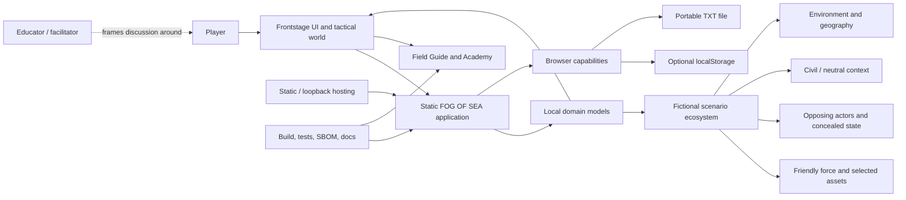
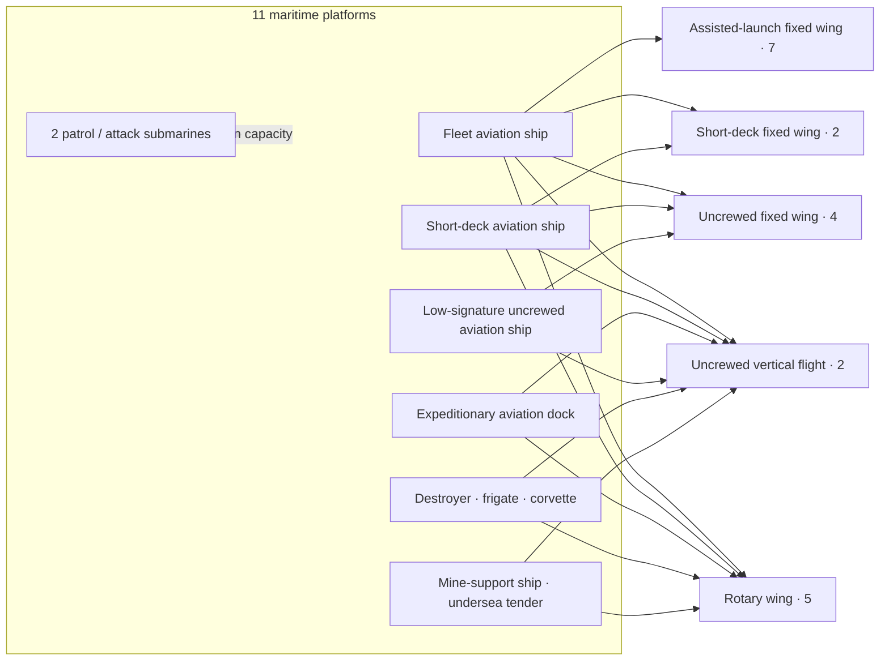
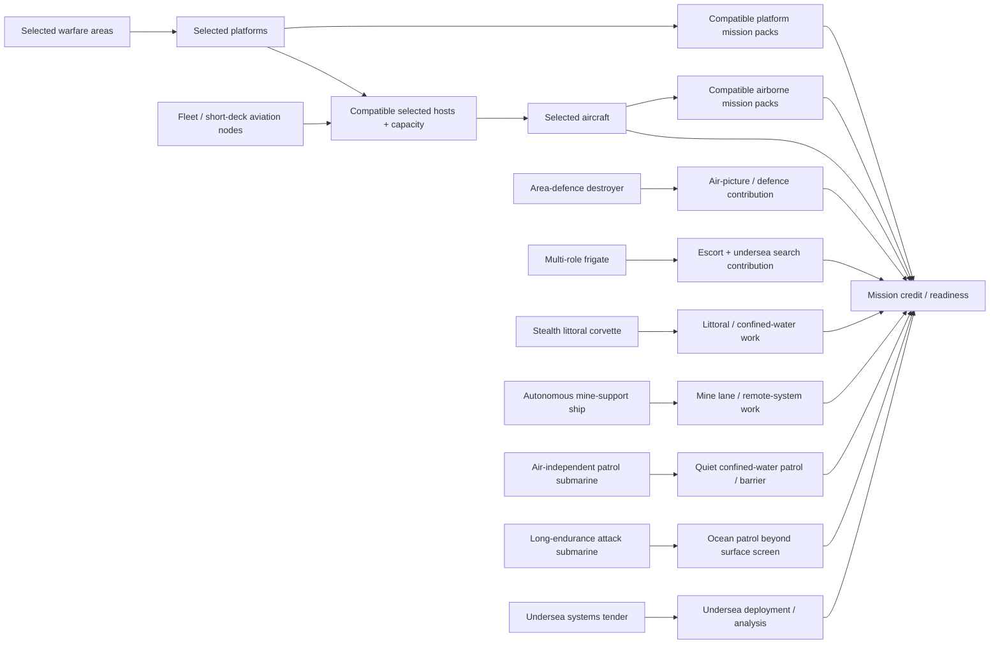

# 07 — Service Blueprint

## 1. Service definition

FOG OF SEA is delivered as a self-contained static browser application. There is no application backend, account service, telemetry pipeline, or cloud-save operator. The “service” is therefore the coordinated behavior of the player’s browser, local application code, local storage choice, portable files, build/release process, and documentation.

## 2. Blueprint lanes

- **Player actions:** what the player does.
- **Frontstage:** visible interface, copy, graphics, sound, and feedback.
- **Backstage:** client-side models and state transitions not directly manipulated.
- **Local support:** browser capabilities, storage, filesystem download/upload, loopback server.
- **Release support:** build, tests, dependency controls, artifacts, documentation.
- **Evidence and recovery:** how correctness is observed and how failure is contained.

## 3. End-to-end blueprint

**Question answered:** What does the product do around the player’s work, from first launch through decision, recovery, learning, persistence, and release support?

| Stage | Player actions | Frontstage | Backstage | Local / release support | Evidence and recovery |
| --- | --- | --- | --- | --- | --- |
| Acquire and start | Extract archive; run `npm run play`; open loopback URL | Printed local address; app shell | Static launcher validates path/method/host and serves `dist` | Node.js, loopback port 5173, bundled assets | Port-in-use stops safely; headers/build verified |
| Establish trust | Read privacy; choose difficulty and storage mode | Modal disclosure; session/save choices; saved-slot list | Hydration, preference setup, slot index parse | Memory or `localStorage` only | Invalid index rejected; no write before opt-in |
| Generate exercise | Start or request new scenario | Atomic new brief and world | Compose candidate; validate 10 coupled facets; retry/fallback | Local entropy; deterministic fallback | No partial candidate; validator diagnostics in tests |
| Understand mission | Read summary/brief; inspect plot; open help | Conditions, narrative, five views, disclosures | Derive environment, celestial, contact, operational frames | WebGL or semantic fallback; Web Audio by choice | Text alternatives; reduced motion; Field Guide |
| Enter compact Visualization | Choose Visualization from workspace menu | Menu disappears; plot becomes current named region | Commit destination, close menu, remove sheet from hit testing, focus plot | Responsive state and CSS | One atomic transition; current game state retained |
| Frame strategy | Select warfare areas, end state, theories, guardrail; optionally write | Ordered steps, lock reasons, completion | Reducer actions; decision completion; text sanitization | Browser memory; optional auto-save | Invalid dependency blocked; prose never scores |
| Build force | Search/add/remove platforms, aircraft, packs | Catalog cards, counters, credit/capacity messages | Host, slot, affiliation, reach, tracking, point and coverage derivation | Local catalogs | Legal state preserved; actionable repair message |
| Review readiness | Inspect gaps; commit or return | Planning recap, environment fit, readiness | Planning assessment and rigid readiness derivation | None beyond client | Return is non-destructive; calculations unit-tested |
| Command | Choose orders; resolve; review report; undo | State grid, situation, matrix range, reports, actions | Activate precommitted matrix; deterministic turn resolution | In-memory state; optional local auto-save | One-turn exact undo; same orders cannot reroll |
| Debrief | Review outcome, evidence, timeline; retry/learn | Score, thresholds, findings, lesson links | Canonical outcome, diagnostics, history record | Optional saved history | Undo final, same-scenario retry, return, new scenario |
| Learn | Browse Academy; answer checks; write notes | Paths, modules, concepts, quiz feedback | Progress state, bounded notes | Stored only under chosen policy | No credit claim; keyboard tabs; local progress reset |
| Persist | Enable/disable/save/load/delete slots | Save manager, status, confirmation | Minimized save, slot policy, canonical parse | Unencrypted `localStorage` | Current session remains if load fails; reset is explicit |
| Export | Download TXT | Readable record and format note | Serialize human report + versioned machine block | Browser download | Active commitments encoded, not encrypted |
| Import | Choose TXT file | Status and restored phase | Size, JSON, shape, allowlist, state replay checks | Browser file API | Atomic rejection; legacy migration bounded |
| Maintain release | Run checks/build/audit/package | Documentation and release notes | Deterministic build scripts | npm registry only during installation/audit | Lint, types, units, browser inventory, licenses, SBOM, artifact validation |

## 4. Lines of interaction and visibility

### Line of interaction

All player actions cross semantic React controls. Direct manipulation of the Three.js scene changes only camera telemetry. It cannot bypass scenario, planning, or command state rules.

### Line of visibility

The player sees explanations and derived summaries, not internal reducer actions, raw catalog indexes, or unrevealed matrix commitments. The TXT machine block is an explicit portability exception and remains bounded/versioned.

### Line of internal interaction

Domain modules exchange typed data. Presentation must not reverse-engineer rules from labels or CSS classes. Persistence must not trust a structurally plausible object without domain and replay validation.

## 5. Blueprint by failure mode

| Failure | Frontstage containment | Backstage containment | Recovery promise |
| --- | --- | --- | --- |
| Incompatible scenario facets | Never displayed | Whole candidate rejected | Fresh candidate; bounded validated fallback |
| Illegal force change | Blocked with reason | Existing legal roster unchanged | Remove dependency or add required host |
| Storage quota/availability | Status message | Session state remains in memory | Disable saving or export TXT |
| Corrupt local slot index | Slot omitted/reported | Safe parser rejects entry | Other valid slots/session remain |
| Malformed or tampered TXT | Import error | No reducer action occurs | Keep current session; choose another file |
| WebGL context failure | Fallback scene | Game rules remain independent | Continue complete play |
| Audio failure | No sound | No rule depends on sound | Continue complete play |
| Missing blur/filter | Opaque panels | Layout/semantics unchanged | Continue complete play |
| Browser test unavailable | Release notes say evidence missing | Source checks still run | Install compatible browser; do not claim pass |

## 6. Privacy blueprint

```text
player chooses session-only
  -> state in memory
  -> optional TXT download under player control

player opts into browser saving
  -> named slot + explicit prose policy
  -> minimized state to localStorage
  -> no network transmission
  -> load validates before reducer

player imports TXT
  -> untrusted file boundary
  -> bounded parser + canonical replay
  -> restore only on complete acceptance
```

The hosting layer may receive ordinary request metadata when serving the static app. The application sends no decisions, save content, or telemetry endpoint request.

## 7. Operational ownership

| Area | Owner responsibility |
| --- | --- |
| Product/design | Phase, disclosure, copy, ethics, journey coherence |
| Domain engineering | Scenario, credit, readiness, matrix, command invariants |
| Visual engineering | Depth, performance, occlusion, fallbacks, reduced motion |
| Security | Input boundary, storage, headers, dependencies, artifacts |
| Accessibility | Semantics, focus, reflow, alternatives, human testing |
| Content/learning | Fictional integrity, lesson provenance, bounded claims |
| Release | Build freshness, evidence, archive integrity, version alignment |

One person may perform several roles, but every release still reviews each responsibility.

## 8. Service-level promises

- A session can be completed without enabling browser storage.
- No gameplay action requires network access after the local release is installed.
- An invalid import cannot partially mutate the current game.
- A visual fallback preserves the complete decision service.
- A loss includes evidence and recovery paths.
- A hidden event cannot be exposed through TXT’s readable section before reveal.
- A scenario is accepted only after the complete candidate passes the implemented structured coexistence checks; this does not establish complete feasibility.
- A repeated state/order pair cannot produce a different result.

## 9. Ecosystem map

**Question answered:** Who and what surrounds the player-facing experience, and where are the real, local, fictional, and release-time boundaries?



<details>
<summary>Text equivalent and boundaries</summary>

- **Real user/service boundary:** player ↔ semantic UI ↔ local application code.
- **Local technical boundary:** browser memory, optional unencrypted `localStorage`, browser file download/upload, WebGL/Web Audio, and loopback/static serving.
- **Portable boundary:** TXT is player-controlled untrusted input on import and validated before state mutation.
- **Fictional boundary:** friendly assets, opposing actors, civilians/neutrals, environment, geography, and concealed commitments are scenario entities, not external services.
- **Learning boundary:** Academy and Field Guide explain the model but do not become hidden scoring inputs.
- **Release boundary:** build, tests, dependency controls, SBOM, documentation, and artifact checks produce evidence for the static release.
- **Facilitation boundary:** an educator may structure discussion around exported/local records, but the product does not create an instructor account or telemetry service.

Sources: [architecture](01-DESIGN-SYSTEM-ARCHITECTURE.md), [security/privacy](09-SECURITY-PRIVACY-TXT.md), [turn intelligence](17-TURN-INTELLIGENCE.md), and [release traceability](11-TRACEABILITY.md).

</details>

## 10. Catalog-grounded asset map

**Question answered:** What modeled maritime and aviation assets exist in the authoritative catalog, and which aviation kinds can their selected hosts support?

This view is generated conceptually from [`app/catalog.ts`](../../app/catalog.ts). It maps the current `PLATFORMS` and `AIRCRAFT` catalog; mission-pack definitions remain separate compatibility data rather than being invented here.



<details>
<summary>Exact catalog roster</summary>

### Maritime platforms — 11

| Domain | Current catalog entries |
| --- | --- |
| Aviation / command surface ships | Fleet aviation ship; Short-deck aviation ship; Expeditionary aviation dock; Low-signature uncrewed aviation ship |
| Escort / specialist surface ships | Area-defence destroyer; Multi-role frigate; Stealth littoral corvette; Autonomous mine-support ship; Undersea systems tender |
| Submarines | Air-independent patrol submarine; Long-endurance attack submarine |

### Aircraft — 20

| Aviation kind | Count | Current catalog entries |
| --- | ---: | --- |
| Assisted-launch fixed wing | 7 | Deck-launched multirole aircraft; Assisted-launch long-range strike aircraft; Assisted-launch fleet interceptor; Electromagnetic-support aircraft; Fixed-wing surveillance aircraft; Deck-launched maritime patrol aircraft; Airborne command-relay aircraft |
| Short-deck fixed wing | 2 | Short-takeoff multirole aircraft; Low-signature short-deck strike aircraft |
| Rotary wing | 5 | Rotary-wing surveillance aircraft; Maritime mission helicopter; Mine-countermeasure rotorcraft; Shipborne rescue rotorcraft; Heavy utility rotorcraft |
| Uncrewed fixed wing | 4 | Shipborne uncrewed combat aircraft; Long-endurance uncrewed strike aircraft; Low-signature uncrewed reconnaissance aircraft; Uncrewed airborne refuelling aircraft |
| Uncrewed vertical flight | 2 | Uncrewed surveillance rotorcraft; Uncrewed vertical logistics aircraft |

### Host rules

- Fleet aviation ship supports all five modeled aviation kinds.
- Short-deck aviation ship supports every modeled kind except assisted-launch fixed wing.
- Expeditionary aviation dock supports rotary and uncrewed vertical flight.
- Low-signature uncrewed aviation ship supports uncrewed fixed and uncrewed vertical flight.
- Area-defence destroyer, multi-role frigate, stealth littoral corvette, autonomous mine-support ship, and undersea systems tender support rotary and uncrewed vertical flight within their individual shared capacity.
- Both submarine categories have no aviation capacity.

The assignment algorithm still requires a compatible **selected** host and remaining shared capacity; this map does not make aircraft available merely because a compatible platform exists in the catalog. See [force design](04-INTERACTION-DESIGN.md#5-force-design) and [`app/catalog.ts`](../../app/catalog.ts).

</details>

## 11. Operational relationship map

**Question answered:** How do current platform roles, aviation hosting, mission credit, sensing, screening, and detached operating semantics connect without imposing a canned strike-group template?

This is an as-built **relationship vocabulary**, not a claim that an automatic spatial-placement engine is already implemented. Relationships below come from current catalog roles/capabilities and force-credit rules.



<details>
<summary>Relationship vocabulary and source anchors</summary>

| Relationship | Current meaning | Authoritative basis |
| --- | --- | --- |
| `hosts` | A selected platform accepts the aircraft aviation kind and has remaining shared capacity | [`app/catalog.ts`](../../app/catalog.ts), force-assignment logic |
| `accepts mission pack` | Platform/aircraft IDs and slots permit that pack | Catalog + force-credit logic |
| `contributes air defence` | Current `airDefenseValue` and role contribute to the modeled force assessment | Area-defence destroyer; multi-role frigate catalog entries |
| `contributes undersea screen/search` | Current `aswValue`, warfare tags, and capabilities contribute undersea coverage | Destroyer, frigate, corvette, mine-support, submarines, tender catalog entries |
| `operates littorally` | Role/capability emphasizes coastal, shallow, or confined-water work | Stealth littoral corvette; AIP submarine |
| `operates beyond surface screen` | Long-endurance submarine capability explicitly describes ocean patrol beyond the surface screen | Long-endurance attack submarine catalog entry |
| `supports mission-space work` | Specialist ship/aircraft role is anchored to mine, rescue, relay, logistics, surveillance, or undersea work rather than generic proximity | Catalog roles and capabilities |
| `credits mission/readiness` | Selection alone is insufficient; hosting, capacity, affiliation, reach, tracking, and mission relevance determine credited contribution | [interaction design](04-INTERACTION-DESIGN.md#5-force-design), [gameplay/decision logic](10-GAMEPLAY-GRAPHICS-DECISION-LOGIC.md) |

This vocabulary is intentionally composition-neutral. It describes what selected assets can support; it does not require a carrier, a fixed escort ratio, a submarine, or a canonical formation.

</details>

## 12. Interactive blueprint navigator

**Question answered:** How can a reader inspect the service blueprint by phase without losing the complete lane table above?

<details>
<summary>Trust and exercise creation</summary>

**Player:** acquire/start → establish trust → generate exercise.  
**Frontstage:** local address, privacy choice, difficulty/storage, atomic accepted brief.  
**Backstage:** static serving, hydration, safe slot parsing, whole-candidate synthesis and validation.  
**Recovery/evidence:** safe port failure, no pre-opt-in write, rejected partial/incompatible candidates.

</details>

<details>
<summary>Reasoning and force construction</summary>

**Player:** understand mission → frame strategy → build force → review readiness.  
**Frontstage:** progressive brief, five views, ordered framing, catalog feedback, readiness recap.  
**Backstage:** derived environment/contact state, reducer actions, text sanitization, host/slot/reach/tracking/credit calculation.  
**Recovery/evidence:** blocked dependencies retain legal state; return from review is non-destructive.

</details>

<details>
<summary>Command, debrief, and learning</summary>

**Player:** form orders and bounded staff judgments → resolve → inspect evidence → debrief → optionally learn.  
**Frontstage:** absolutely known state, potentials, Immediate/History, deterministic reports, Cause → Evidence → Adjustment, Academy links.  
**Backstage:** precommitted uncertainty, typed public intelligence projection, deterministic turn transition, canonical outcome/history.  
**Recovery/evidence:** exact one-turn undo, same-order replay stability, supported learning links, no prose scoring.

</details>

<details>
<summary>Persistence, portability, and release</summary>

**Player:** optionally save/load → export/import TXT.  
**Frontstage:** named local slots, explicit writing policy, human-readable record, import status.  
**Backstage:** minimized save, canonical parser/replay, version migration.  
**Support:** browser storage/file APIs plus build/test/license/SBOM/documentation processes.  
**Recovery/evidence:** failed load/import leaves current session intact; invalid release evidence is reported rather than converted into a pass claim.

</details>
