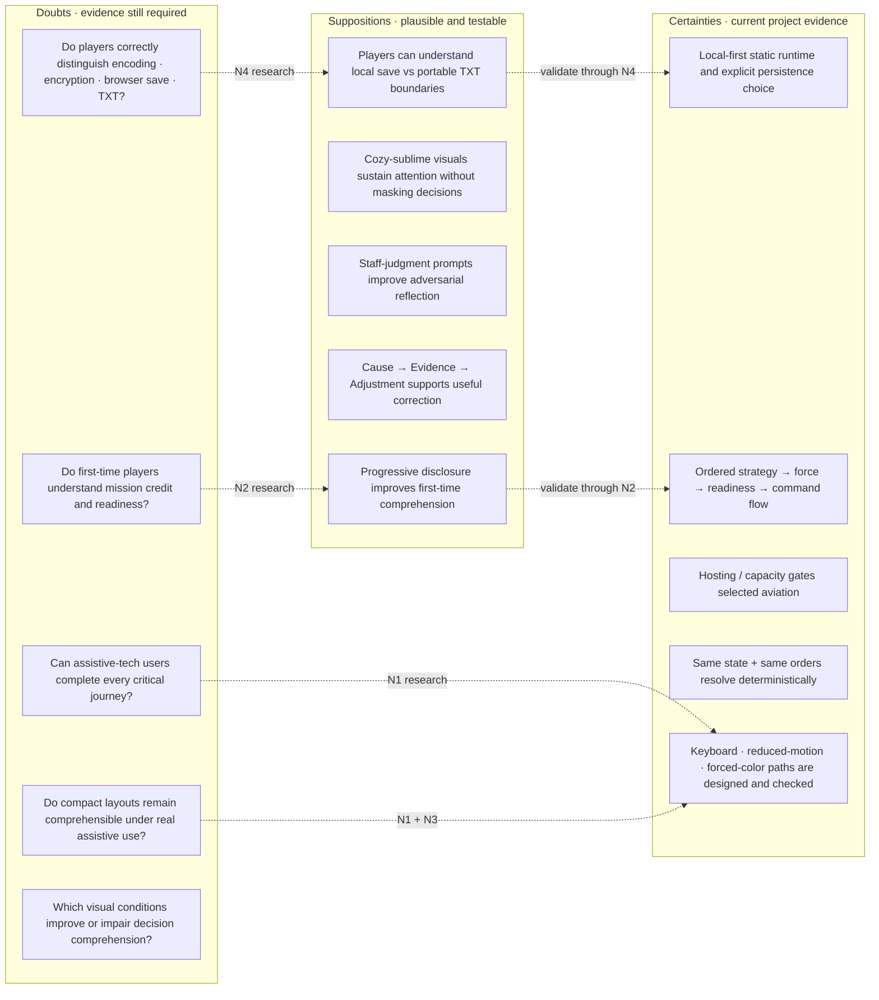
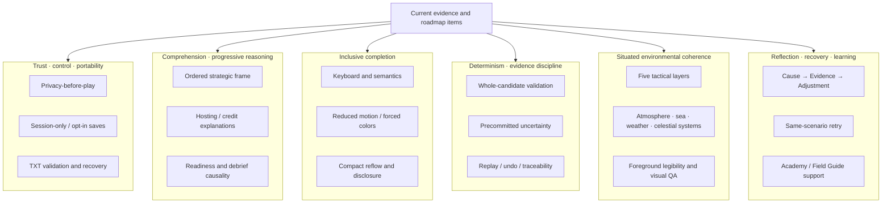

# 08 — UX Roadmap

## 1. Roadmap method

This roadmap prioritizes evidence and coherence over feature count. Candidate work is scored qualitatively against:

1. user value;
2. accessibility and security risk reduction;
3. evidence gap;
4. architectural fit;
5. reversibility;
6. effect on fictional/educational boundaries;
7. maintenance and performance cost.

No roadmap item is an as-built claim.

## 2. Now — as-built baseline

### Trust and portability

- Required privacy-before-play choice.
- Session-only and opt-in named browser saves.
- Per-slot written-analysis minimization.
- Human-readable, resumable TXT export/import.
- Restrictive local static runtime and dependency evidence.

### Learning and play

- Whole-candidate scenario synthesis and coexistence validation.
- Ordered strategic frame, force credit, readiness, six-turn deterministic command, and diagnostic debrief.
- Guided, Standard, and Challenge modes.
- Twenty-five-module Academy and Field Guide.

### Experience

- Five visualization layers and four time presentations.
- Dense low-poly stars, atmosphere, weather, sea, aurora, celestial geometry, and subject emission.
- Brightest-star continuity at Dawn and Dusk without changing the established star material or motion profile.
- Non-painting coordinate helpers and compact continuously routed dolphins.
- Atomic compact workspace entry into Visualization.
- Glass desktop/compact surfaces with opaque and forced-color fallbacks.
- Keyboard, semantic, reduced-motion, reflow, and compact-disclosure support.

## 3. Near — validate comprehension and inclusive completion

### N1. Human accessibility evidence

Conduct manual task-based testing with screen readers, keyboard-only use, magnification, speech input, switch access, and mobile assistive technology.

**Exit evidence:** participants complete privacy, planning, force, command, save, import, Academy, and debrief tasks; barriers are recorded by combination rather than generalized.

### N2. Comprehension playtest

Run the existing playtest protocol with first-time and experienced strategy players across contrasting environment profiles.

**Exit evidence:** release thresholds for mission fit, environment fit, compatibility, strategic logic, and debrief learning are met or the failed layer is revised and retested.

### N3. Compact disclosure field study

Test 320, 375, 430, 567, and zoom-equivalent compact widths with long translated-like strings and all four disclosures.

**Exit evidence:** central scene corridor remains available; no accidental wrapper paint; no essential content clipped or hover-only.

### N4. TXT recovery study

Observe people exporting, identifying the machine block warning, moving, importing, and recovering from malformed files.

**Exit evidence:** people distinguish human record, machine resume data, encoding, encryption, browser save, and TXT backup.

## 4. Next — improve reasoning, comparison, and environmental coherence

### X1. Side-by-side plan comparison

Allow local comparison of two completed records without merging or uploading them. Highlight changed decisions, turn evidence, and outcome deltas.

**Guardrails:** read-only, local, bounded file size, no claim that one run establishes causality.

### X2. Explainable readiness drill-down

Expose a compact trace from requirement → selected host → capacity → mission credit → readiness contribution.

**Guardrails:** avoid duplicating every internal formula in the primary flow; preserve progressive disclosure.

### X3. Scenario validation narrative

Provide a player-facing “why these conditions coexist” summary derived from the accepted validator result, without exposing generation attempts or internal identifiers.

**Guardrails:** does not imply meteorological forecast accuracy.

### X4. Environmental visual QA harness

Add deterministic capture matrices covering climate, time, weather tier, view, theme, motion preference, and compact width. Compare composition, occlusion, foreground legibility, and performance budgets.

**Guardrails:** pixel metrics supplement human art direction; they do not define beauty alone.

### X5. Academy-to-play reflection loop

Let players locally pin a lesson concept to a planning recap and revisit it after debrief.

**Guardrails:** optional, unscored, included in browser storage only under explicit writing policy.

## 5. Later — facilitation and deeper local analysis

### L1. Facilitator packet generator

Generate a local printable brief, observer sheet, bounded discussion questions, and anonymized scoring rubric from an accepted scenario.

### L2. Local sensitivity lab

Permit controlled comparison of one disclosed parameter at a time while preserving all other commitments. Label it as model exploration, not normal play.

### L3. Advanced replay visualization

Replay the six-turn timeline with state deltas, disclosed contacts, and environmental time, with pause and reduced-motion support.

### L4. Localization readiness

Externalize player-facing strings, test expansion/contraction, define locale-safe number/date formats, and preserve save schema values independent of display copy.

### L5. Performance tiers

Measure scene budgets and select local quality tiers that first reduce decorative density while preserving weather severity, occlusion, unit visibility, and text alternatives.

## 6. Explicit non-goals

The roadmap does not include:

- mandatory accounts or cloud persistence;
- advertising, behavioral tracking, or engagement telemetry;
- monetized chance mechanics, streaks, or daily pressure;
- official identifiers, copied force tables, or operational claims;
- opaque adaptive adjudication;
- prose scoring;
- hiding uncertainty to make outcomes feel more dramatic;
- graphics that compromise keyboard, reduced-motion, forced-color, or fallback completeness.

## 7. Measurement without product telemetry

FOG OF SEA does not require embedded analytics to improve. Use:

- moderated task sessions with consent;
- anonymous local observation sheets;
- the existing comprehension rubric;
- keyboard and assistive-technology walkthroughs;
- deterministic browser captures and performance profiles;
- local import/export fixtures;
- voluntary, paraphrased qualitative feedback;
- release defect counts and test coverage as engineering evidence, not user-behavior proxies.

Do not add participant records to the application or release archive.

## 8. Release decision rubric

An item is ready when:

- its user problem and non-goals are documented;
- domain, privacy, security, accessibility, and persistence impacts are reviewed;
- failure and recovery behavior is implemented;
- compact and fallback paths are complete;
- claims match observed evidence;
- documentation and release artifacts agree;
- no existing functionality is silently removed.

## 9. CSD matrix — Certainties, Suppositions, Doubts

**Question answered:** Which product and user-experience statements are supported strongly enough to treat as current certainties, which remain plausible hypotheses, and which are explicit research questions?

This uses the NN/g CSD framing of **Certainties, Suppositions, and Doubts**. “Certainty” here means supported by the current project evidence for the stated scope, not universal or permanent truth. Items move between columns as evidence changes.

Evidence-linked CSD matrix

| Topic | Certainty | Supposition | Doubt / next evidence |
| --- | --- | --- | --- |
| Trust and persistence | The product offers session-only use, opt-in browser saving, and TXT portability; invalid imports are intended to be atomic | The boundary is understandable without technical expertise | **N4:** observe export/import and ask users to distinguish encoding, encryption, browser storage, and portable backup |
| Decision sequence | Strategic framing gates force construction; force and readiness precede command | Progressive disclosure helps novices form the model rather than merely comply with it | **N2:** test mission fit, compatibility, strategic logic, and debrief comprehension with first-time and experienced players |
| Force model | Aircraft require compatible selected hosting/capacity; selected items are not automatically mission-credited | Explainable readiness traces will improve causal understanding without overloading play | **X2:** prototype and test requirement → host → capacity → credit → readiness disclosure |
| Determinism and uncertainty | Command resolution and exact undo are designed to prevent rerolling identical state/order pairs | Players experience committed uncertainty as fair rather than arbitrary | **N2:** collect explanation of what was known, uncertain, and committed before/after turns |
| Accessibility | Semantic controls, keyboard paths, reduced motion, forced colors, fallback graphics, and reflow are release requirements | These technical paths provide equivalent task comprehension in real assistive use | **N1/N3:** complete critical tasks with screen reader, keyboard, magnification, speech/switch/mobile AT and compact layouts |
| Visual world | Environmental systems preserve foreground hierarchy by design and have deterministic QA targets | The visual atmosphere sustains attention and situated reasoning without distracting from decisions | **X4 + human testing:** compare legibility, occlusion, comprehension, and performance across deterministic environment captures |
| Adversarial reflection | Turn 2–6 staff judgments are recorded but excluded from adjudication | Requiring intent/pattern/next-action hypotheses improves adversarial modeling | **N2:** observe whether players distinguish evidence from hypothesis and revise beliefs after new observations |
| Debrief learning | Debrief presents outcome, thresholds, timeline, and Cause → Evidence → Adjustment findings | Players can carry the correction into a better second plan rather than only optimize score | Compare same-scenario retries and participant explanations without claiming external transfer |

Primary project sources: [interaction design](04-INTERACTION-DESIGN.md), [service blueprint](07-SERVICE-BLUEPRINT.md), [traceability](11-TRACEABILITY.md), [heuristic evaluation](15-HEURISTIC-EVALUATION.md), [turn intelligence](17-TURN-INTELLIGENCE.md), and this roadmap.

Method reference: [NN/g — CSD Matrix: Framework and Template for Shared Understanding](https://www.nngroup.com/articles/csd-matrix/).

## 10. Evidence affinity diagram

**Question answered:** What recurring themes emerge when current as-built behavior, design requirements, known risks, and near-term evidence gaps are clustered by similarity?

This affinity view clusters **documented project evidence and open research work**, not invented user quotes. It should be regenerated when the evidence base materially changes.

Cluster interpretation and linked evidence

| Cluster | What grouped together | Design implication | Evidence still needed |
| --- | --- | --- | --- |
| Trust · control · portability | Privacy choice, minimized local saves, TXT boundary, atomic import rejection | Keep technical trust explanations at decision boundaries; do not occupy play chrome with repetitive assurances | N4 portability/recovery comprehension |
| Comprehension · progressive reasoning | Ordered framing, blocked-dependency explanations, mission credit, readiness, debrief | Reveal the next meaningful decision and one repair before deeper formulas | N2 comprehension and X2 readiness drill-down |
| Inclusive completion | Keyboard, semantics, fallback, reduced motion, forced colors, compact disclosure | Accessibility is behavioral parity, not visual accommodation after implementation | N1 human AT testing and N3 compact study |
| Determinism · evidence discipline | Whole-candidate validation, committed uncertainty, replay, undo, traceability | Preserve reproducibility and distinguish hidden commitments from arbitrary rerolls | Human comprehension of uncertainty and evidence, not only test pass rate |
| Situated environmental coherence | Tactical layers, low-poly environment, weather/celestial systems, foreground hierarchy | Visual richness must support orientation and attention while remaining subordinate to decision information | X4 deterministic visual QA plus human legibility review |
| Reflection · recovery · learning | Diagnostic findings, same-scenario retry, Academy/Field Guide | Failure should produce inspectable correction paths rather than punishment or unsupported praise | Whether players make materially different, explainable second plans |

The clustering is sourced from the as-built baseline in §2, research items N1–N4, improvement items X1–X5, and the design/release constraints in §§6–8. It is an organizing view of that evidence, not an additional source of truth.

