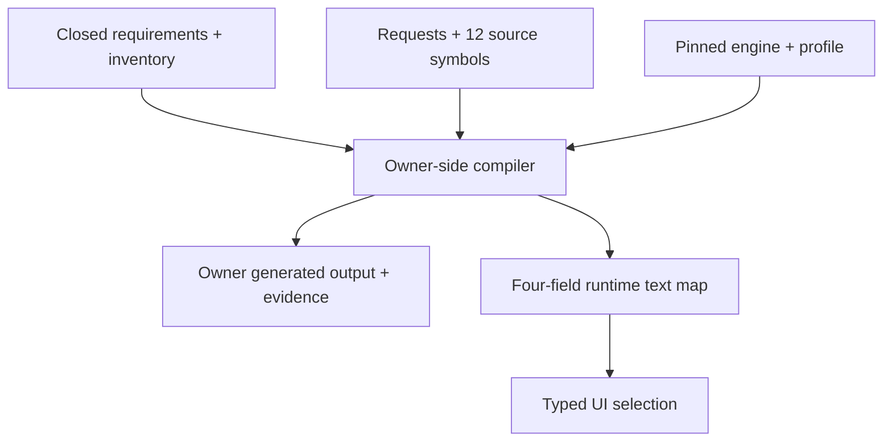

# 16 — Bounded Lattice Copy Architecture

Status: implemented bounded slice; broad adoption blocked

Applies to: selected Field Guide, post-resolution learning, and Academy interface copy
Does not establish: source truth, human review, accessibility approval, domain approval, full Academy sourcing, or product-wide Lattice adoption

## 1. Decision

FOG OF SEA uses Lattice as an owner-side static-copy compiler. It does not ask
the browser to generate, rank, or validate prose. This separation lets selected
copy use the Relational Systems register while keeping mechanics, disclosure,
storage, and accessibility behavior owned by typed application state.

The authorized slice is fixed at:

- 19 authoring requests;
- 26 published outputs;
- 12 hashed TypeScript source-symbol declarations;
- seven Field Guide subjects with paired operative and interpretive outputs;
- seven turn/outcome learning outputs;
- five Academy Compare or Sources & Scope outputs; and
- a read-only advisory lint over 1,011 Academy curriculum-data strings in two
  bounded batches.

No count above implies comprehensive coverage. Thirty-seven inventory units
make the adopted, advisory, exempt, out-of-scope, and blocked families visible.
An adopted unit's `targetAssurance` is a governance review target, not emitted
Lattice conformance; current owner outputs remain capped at `degraded`.

## 2. Pinned owner inputs

| Input | Pin |
| --- | --- |
| Lattice repository | `d6cc85b275e3f14163a5a547f626832fd21b27b0` |
| Engine | `0.1.1` |
| Profile | `relational-systems` `v1.0.0` |
| Profile digest | `379ed01484574edc779efdc502ffbd6d9b8ffef3c9154fb027b0f0c8475ed21a` |
| Owner-package digest | `58648d097c863090a95f48ebca2b20d5a6f6c2b832c915b9bac04f479d51d3b0` |
| FOG OF SEA inventory baseline | `70907a77cba735c151e52929dd5a56d795c3d04f` |

The owner-package digest is derived as SHA-256 over stable JSON containing the
manifest format, pinned commit, algorithm label, and ordered `{path, sha256}`
records. The closed manifest covers `package.json`,
`profiles/relational-systems.profile.json`, and the complete module graph loaded
from `dist/index.js`: constants, context, engine, errors, index, predicates,
profile, relational-systems, semantic, util, and validators. The owner compiler
hashes those checkout bytes before and after realization. The offline verifier
independently reconstructs the declared manifest digest but, without the owner
checkout, does not claim to re-hash its files.

Compilation fails closed when a pin, request shape, declaration hash, route,
candidate selection, assertion, or governed identifier differs. A source hash
establishes identity and drift detection only. It does not prove that source
content is true, correct, accessible, current, or approved.

## 3. Build-time evidence chain

The compiler reads only the exact requirement and inventory authorities. Each
request names active requirement IDs, non-exempt inventory IDs, publication
owners, and hashed source-symbol references. The compiler then verifies the
closed request contract, runs the pinned engine, verifies its receipt, binds a
provided result to the exact selected candidate text, evaluates declared host
assertions, and writes content-addressed owner evidence.

The fourteen-file implementation-authority manifest binds `package.json`, the
lockfile, all seven Lattice and governance schemas, the compiler, corpus
extractor, executable schema validator and its TypeScript declaration, and the
independent verifier. Its file hashes and aggregate digest participate in the
generated snapshot, evidence, index, and snapshot identity. Any change to those
executable gates or their locked toolchain therefore requires recompilation
under a new snapshot identity.

The schema validator pins Ajv `8.17.1`, executes Draft-07 and Draft 2020-12 as
declared by each schema, and runs in the compiler before emission, in the
offline verifier, and as an explicit release check. It uses `allErrors: true`,
`validateSchema: true`, `strictSchema: true`, and `strictNumbers: true`.
`strictTypes`, `strictRequired`, and `strictTuples` alone are disabled to permit
standards-valid branch-local compositions in the governed schemas. Those exact
options are part of the hash-bound validator implementation rather than ambient
defaults; unknown schema keywords and non-finite in-memory numbers are rejected.

The evidence chain is acyclic: request and source inputs determine generated
output; generated output cannot validate its own inputs. Offline verification
recomputes the request, source, traceability, realization, Academy corpus/lint,
copy, and file digests.

Human review is deliberately recorded as `not-claimed`. Current outputs have a
maximum conformance claim of `degraded`; neither successful compilation nor a
receipt upgrades them to full conformance or human approval.

Emission compares canonical bytes first. Identical files are left untouched;
changed files are staged and replaced individually. This is not a claim of a
cross-file filesystem transaction or immutable storage.

## 4. Runtime boundary

The runtime JSON has exactly four fields:

1. `schemaVersion`;
2. `snapshotId`;
3. `copySha256`; and
4. `copy`, a publish-ID-to-string map.

The release must not include the engine, profile, owner-package digest,
requests, candidates, atoms, semantic assertions, receipts, source catalog,
traceability graph, or review metadata. Artifact validation scans every emitted
file's raw bytes for owner-only markers, exact identities, and provenance
values. It also decodes textual assets for release checks and requires known
binary extensions to carry the corresponding file magic, so renaming text as a
binary asset does not bypass inspection.

## 5. Layer and route boundaries

Operative copy states exact action, state, consequence, scope, or recovery.
Interpretive copy may explain relationships and consequence only after the
operative meaning is secured. Accessibility equivalents preserve the same
meaning without depending on imagery, implication, color, sound, or position.

### Debrief routes

| Inventory unit | Layer | Surface | Mode | Stakes |
| --- | --- | --- | --- | --- |
| `FOS-COPY-DEBRIEF-001` | Interpretive | After-action | Aftermath | Consequential |
| `FOS-COPY-DEBRIEF-002` | Operative | After-action | Aftermath | Ambient |
| `FOS-COPY-DEBRIEF-003` | Operative | Report | Technical | Consequential |

The after-action route covers bounded outcome interpretation; the ambient route
covers a pending review; the technical report route covers resolved-turn states
and the unscored-writing note. None of these strings determine the state that
selects them.

### Field Guide routes

| Units | Subject route | Layers |
| --- | --- | --- |
| `FOS-COPY-GUIDE-001` / `002` | Tutorial · technical · consequential | Interpretive / operative |
| `FOS-COPY-GUIDE-003` / `004` | Tutorial · action · consequential | Operative / interpretive |
| `FOS-COPY-GUIDE-005` / `006` | Tutorial · analysis · consequential | Operative / interpretive |
| `FOS-COPY-GUIDE-007` / `008` | Public notice · technical · consequential | Operative / interpretive |
| `FOS-COPY-GUIDE-009` / `010` | Tutorial · aftermath · consequential | Operative / interpretive |

The seven subjects are mission credit, scenario acceptance, uncrewed/undersea
employment, command turns, strategic fit, model boundary, and mission learning.
Pairing does not authorize transformation of catalog values, score formulas,
controls, or safety/trust instructions.

### Turn-intelligence boundary

The command intelligence feature deliberately remains outside the current
transformation slice. **Absolutely known**, **Potentials · staff judgment**,
the three required selector questions, **Immediate**, **History**,
**Discovered during Turn N**, empty states, focus instructions, save/replay
errors, and scoring/disclosure boundaries are operative control or
information-boundary language. They are controlled literals formatted from
typed state in `commandIntelligence.ts` and `CommandIntelligencePanel.tsx`.

Lattice copy never decides whether a claim is absolute, which potential is
reasonable, whether Resolve is enabled, or which occurrence/discovery group
owns a fact. Adding optional interpretive coaching for this feature would
require a separately versioned inventory/request/output/evidence expansion;
it could not replace the operative layer or silently expand the governed
19-request/26-output snapshot.

### Academy routes

| Inventory unit | Copy | Route |
| --- | --- | --- |
| `FOS-COPY-ACADEMY-004` | Compare introduction | Interpretive · reflection · analysis · consequential |
| `FOS-COPY-ACADEMY-005` | Independence status | Operative · public notice · institutional · consequential |
| `FOS-COPY-ACADEMY-006` | Sources introduction | Interpretive · public notice · exposition · consequential |
| `FOS-COPY-ACADEMY-007` | Model boundary | Operative · public notice · technical · consequential |
| `FOS-COPY-ACADEMY-008` | Language-system explanation | Interpretive · public notice · technical · consequential |

Lesson bodies, knowledge checks, answers, source claims, and player-authored
notes are not rewritten. The 1,011-string Academy corpus pass is automated,
read-only, and advisory. It does not establish complete sourcing, factual
accuracy, quiz validity, or comprehension.

## 6. Mechanics and replay isolation

Typed diagnostic codes select post-resolution learning. Presentation prose is
not searched to decide whether a task, reach, contact, employment, force,
objective, supply, integrity, or guardrail mismatch occurred. Save import and
canonical replay validate adjudication fields and regenerate current
presentation prose; serialized prose is not accepted as rule authority.

This architecture also constrains the language itself:

- an absent tracked mismatch is not called proof that the turn was correct;
- an absent final finding is not called proof of victory or optimal play;
- a committed matrix failure is not called a hidden rule or proven player
  error;
- findings are not ranked as the “strongest” unless a ranking rule exists;
- writing is stated to be unevaluated, while the outcome is attributed to the
  model's invented rules, recorded game state, and selected orders; and
- structured scenario coexistence is not called complete feasibility.

## 7. Broad-adoption gate

Broad adoption is blocked by three known prose-to-logic couplings:

| Blocker | Risk |
| --- | --- |
| `app/gameModel.ts` | Reworded scenario narrative can change generation or validation behavior |
| `app/catalogMath.ts` | Reworded catalog fields can change affiliation, compatibility, or mission credit |
| `app/contactVisualization.ts` | Reworded contact descriptions can change disclosure or classification behavior |

Removing one blocker does not clear the others. Each must be replaced with a
typed owner, receive positive, negative, boundary, and combination tests, and
be added to the evidence chain before its copy family can leave `blocked`.

## 8. Verification limits

Static schemas, compiler checks, offline verification, unit tests, red-team
mutations, build checks, and artifact inspection can establish structural and
declared-contract properties. They do not establish source truth, maritime or
educational correctness, universal accessibility, or human understanding.

The browser suite can be enumerated without a browser installation. In this
workspace a compatible Chromium executable was unavailable, so no live browser
assertion is claimed for this pass. Human assistive-technology and copy
comprehension review remain separate evidence obligations.

## 9. Change protocol

Any change to a selected string, route, source declaration, output target,
engine/profile pin, or runtime boundary must update its atomic requirement and
inventory unit, regenerate the snapshot, run offline verification and the
red-team suite, inspect the release artifact, and record the evidence limit.
Historical failed evidence is retained rather than rewritten into a pass.
