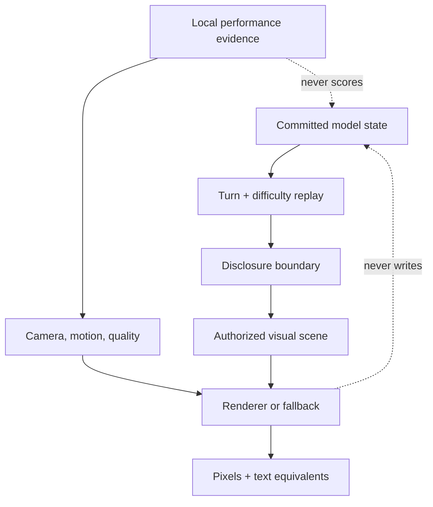

# 19 — Visual authority concept map and CSD matrix

Status: interactive Markdown · 2026-09-12

This analysis uses Nielsen Norman Group’s [Certainties, Suppositions, and Doubts framework](https://www.nngroup.com/articles/csd-matrix/). Native links and `
` make it usable without JavaScript, pointer hover, animation, or Mermaid rendering.

Jump to: [concept map](#concept-map) · [certainties](#certainties) · [suppositions](#suppositions) · [doubts](#doubts) · [decision rule](#decision-rule)

## Concept map

**Question answered:** How does authoritative state become a visual without becoming game truth?

Text equivalent: authority flow

The committed model owns scenario disruptions and mechanics. Turn and difficulty select the replayed state. Disclosure selects what may be known. The authorized-scene adapter copies only granted facts. WebGL and fallback render the same disclosed meaning. Camera, motion, and quality affect presentation only. Local measurements may tune presentation but never adjudication.

Threat path: inference becomes authority

Prohibited path: dramatic wave → renderer labels TSUNAMI → label changes damage. A future correction requires a new versioned canonical hazard model plus separately authorized presentation; the unversioned attempt was removed because it invalidated existing played saves. An extreme-looking ordinary sea remains ordinary model state.

Threat path: capability becomes intelligence

Prohibited path: credited radar → random contact. The adapter requires a shape-valid caller-supplied estimate plus credited domain sensing, but cannot establish authority itself. The current application passes no estimates. Any future caller must establish authority upstream; without both operands, the output is empty.

## CSD matrix

| Certainties—source/test bounded | Suppositions—to validate | Doubts—must remain open |
| --- | --- | --- |
| Severe-weather disruptions remain deterministic and mechanically consumed. | Adjacent quality tiers will hide degradation better than large jumps. | Can an explicit hazard model be versioned without changing existing reports or outcomes? |
| No supplied estimate means zero contact markers. | Selective Dream accents will retain the intended “living model” character. | What are retained heap and GPU-allocation slopes over long sessions? |
| Current baseline release check passes after local dependency repair. | Pausing RAF behind overlays will reduce pressure without a visible resume hitch. | How do physical phones thermally throttle over 20–30 minutes? |
| Browser execution is blocked before product assertion because the pinned executable is absent. | Worker placement will improve interaction latency for maximum legal forces. | Do screen-reader users understand severe-weather/contact uncertainty? |
| Blender has no qualified need and is absent from dependencies. | Batched source capture plus one finite 109-tap, three-scale accumulation can meet declared pacing and memory budgets at maximum visible density. | Are flash/luminance envelopes safe under every weather/theme combination? |

### Certainties

C1 · Severe-weather authority boundary

`app/scenarioMatrix.ts` retains the existing deterministic severe-weather disruption and its mechanically consumed active window. No standalone environmental-hazard or TSUNAMI model is shipped. The unversioned `environmentalHazards` attempt was removed after it made valid played saves fail the unchanged version-4 validator; a future hazard requires an explicit schema version and migration before it can become model authority.

C2 · Contact truth

`app/contactVisualization.ts` shape-checks caller-supplied estimate records; capability only filters them. It does not prove their authority. The current application passes an empty set, and tests establish zero output plus fail-closed handling of denied capability, invalid values, inherited fields, and accessors without getter execution. Upstream provenance, persistence, a positive browser path, and spatially equivalent nonvisual semantics remain absent.

C3 · Baseline boundary

The baseline records repository checks and artifact sizes. It explicitly does not claim presented frames, browser timings, resource pressure, physical thermal behavior, or human accessibility results.

### Suppositions

S1 · Quality governor

Hypothesis: three poor windows, eight good windows, adjacent transitions, and a 20-second cooldown balance responsiveness and stability. Validate at 60/90/120 Hz and under alternating load.

S2 · Selective Dream emission

Hypothesis: filled authorized native-color sources plus a bounded, view-conditioned exterior field communicate the desired aesthetic while production geometry and directly lit materials remain unchanged. Validate actual models, side and overhead views, core identity, native color, and device budgets; decorative creature glow must confer no authority.

S3 · Relational placement

Hypothesis: host, screen, protection, relay, undersea, mine, rescue, refueling, and logistics constraints improve scene legibility without fabricating operational roles. Validate against all legal ≤100-point forces.

### Doubts

D1 · Devices, pressure, and thermal behavior

No browser executable or physical device evidence exists in this environment. CPU/GPU pressure, retained memory, battery, and thermal throttling remain unknown.

D2 · Human accessibility and comprehension

Source semantics are necessary but insufficient. Keyboard, touch, screen-reader, forced-color, vestibular comfort, and comprehension require executed and human review.

D3 · Full hostile-combination envelope

Rain, snow, fog, overcast, aurora, celestial bodies, severe seas, wakes, overlays, camera extremes, and both themes have not yet been executed across the device matrix. TSUNAMI is not a current matrix state and remains a future versioned-model question rather than an unexecuted rendering case.

## Decision rule

A supposition becomes a certainty only when its named acceptance evidence exists. A doubt cannot be worded as “supported,” “optimized,” or “accessible.” If evidence fails, retain the failure, correction, rerun, and claim boundary in the red-team ledger.
