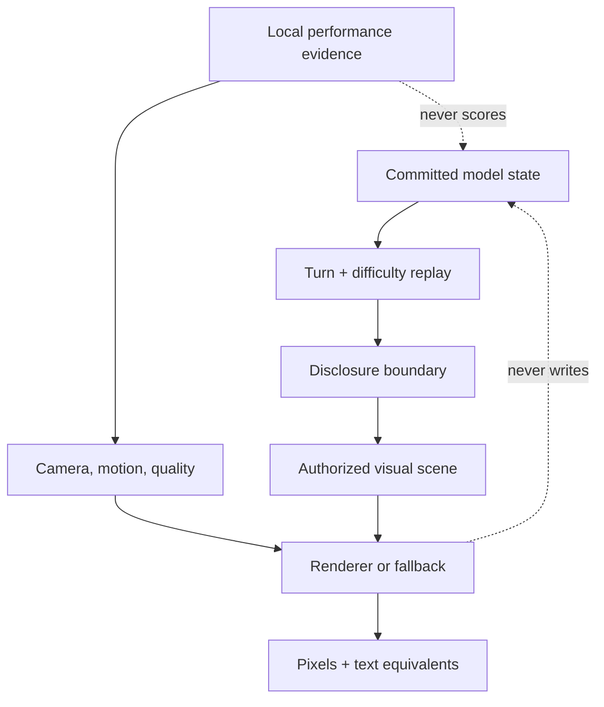

# 19 — Visual authority concept map and CSD matrix

Status: interactive Markdown · 2026-09-12

This analysis uses Nielsen Norman Group’s [Certainties, Suppositions, and Doubts framework](https://www.nngroup.com/articles/csd-matrix/). Native links and `
` make it usable without JavaScript, pointer hover, animation, or Mermaid rendering.

Jump to: [concept map](#concept-map) · [certainties](#certainties) · [suppositions](#suppositions) · [doubts](#doubts) · [decision rule](#decision-rule)

## Concept map

**Question answered:** How does authoritative state become a visual without becoming game truth?

Text equivalent: authority flow

The committed model owns hazards and mechanics. Turn and difficulty select the replayed state. Disclosure selects what may be known. The authorized-scene adapter copies only granted facts. WebGL and fallback render the same disclosed meaning. Camera, motion, and quality affect presentation only. Local measurements may tune presentation but never adjudication.

Threat path: inference becomes authority

Prohibited path: dramatic wave → renderer labels TSUNAMI → label changes damage. Correction: canonical hazard → mechanics and separately authorized presentation; an extreme-looking ordinary sea remains ordinary model state.

Threat path: capability becomes intelligence

Prohibited path: credited radar → random contact. Correction: canonical disclosed estimate + credited domain sensing → marker. Without the first operand, the output is empty.

## CSD matrix

| Certainties—source/test bounded | Suppositions—to validate | Doubts—must remain open |
| --- | --- | --- |
| Hazard timeline is deterministic and mechanically consumed. | Adjacent quality tiers will hide degradation better than large jumps. | Do target p95 budgets hold on representative weak and strong devices? |
| No canonical estimate means zero contact markers. | Selective Dream accents will retain the intended “living model” character. | What are retained heap and GPU-allocation slopes over long sessions? |
| Current baseline release check passes after local dependency repair. | Pausing RAF behind overlays will reduce pressure without a visible resume hitch. | How do physical phones thermally throttle over 20–30 minutes? |
| Browser execution is blocked before product assertion because the pinned executable is absent. | Worker placement will improve interaction latency for maximum legal forces. | Do screen-reader users understand hazard/contact uncertainty? |
| Blender has no qualified need and is absent from dependencies. | Three native-color emission layers can fit the draw-call budget. | Are flash/luminance envelopes safe under every weather/theme combination? |

### Certainties

C1 · Authoritative hazards

`app/environmentalHazard.ts`, `app/scenarioMatrix.ts`, and focused tests establish deterministic generation, difficulty gating, bounded signed N-wave data, and mechanical consumption. This is a source-and-test certainty, not live browser evidence.

C2 · Contact truth

`app/contactVisualization.ts` accepts canonical disclosed estimates. Capability only filters. Tests also establish that inherited and accessor-backed estimates fail closed without getter execution.

C3 · Baseline boundary

The baseline records repository checks and artifact sizes. It explicitly does not claim presented frames, browser timings, resource pressure, physical thermal behavior, or human accessibility results.

### Suppositions

S1 · Quality governor

Hypothesis: three poor windows, eight good windows, adjacent transitions, and a 20-second cooldown balance responsiveness and stability. Validate at 60/90/120 Hz and under alternating load.

S2 · Selective Dream emission

Hypothesis: small emissive accents plus tight/broad/hot native-color layers communicate the desired aesthetic while hard structural surfaces remain non-emissive. Validate with references and luminance capture.

S3 · Relational placement

Hypothesis: host, screen, protection, relay, undersea, mine, rescue, refueling, and logistics constraints improve scene legibility without fabricating operational roles. Validate against all legal ≤100-point forces.

### Doubts

D1 · Devices, pressure, and thermal behavior

No browser executable or physical device evidence exists in this environment. CPU/GPU pressure, retained memory, battery, and thermal throttling remain unknown.

D2 · Human accessibility and comprehension

Source semantics are necessary but insufficient. Keyboard, touch, screen-reader, forced-color, vestibular comfort, and comprehension require executed and human review.

D3 · Full hostile-combination envelope

Rain, snow, fog, overcast, aurora, celestial bodies, severe seas, TSUNAMI, wakes, overlays, camera extremes, and both themes have not yet been executed across the device matrix.

## Decision rule

A supposition becomes a certainty only when its named acceptance evidence exists. A doubt cannot be worded as “supported,” “optimized,” or “accessible.” If evidence fails, retain the failure, correction, rerun, and claim boundary in the red-team ledger.

