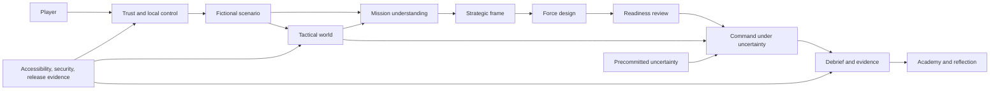
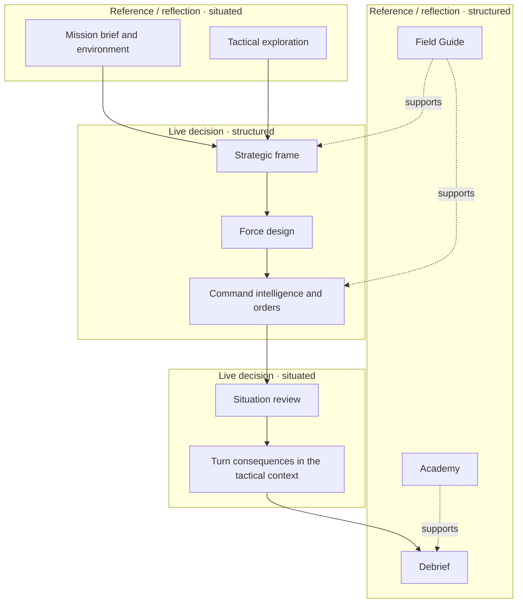
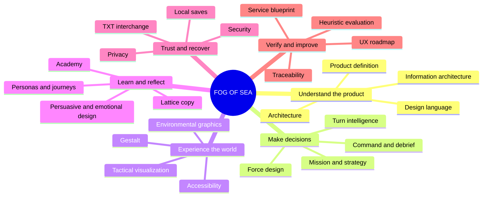

# FOG OF SEA — Product, UX, and Design Documentation

Status: as-built specification with an evidence-based roadmap  
Applies to: local build `2026-08-11-VSCODIUM-13`  
Audience: product design, interaction design, visual design, engineering, security review, accessibility review, facilitation, and playtesting

## Purpose

This suite documents FOG OF SEA as one coherent service: the pre-play privacy choice, generated exercise, planning workflow, force construction, tactical visualization, six-turn command game, adjudication, debrief, Academy, local saving, TXT interchange, accessibility, security, and release evidence.

The documentation distinguishes three kinds of statement:

- **As built** describes behavior implemented in the current source.
- **Design rule** describes a constraint that present and future work must preserve.
- **Roadmap** describes proposed work and is not a claim about the current product.

## Document map

| Document | Question answered |
| --- | --- |
| [01 — Design system architecture](01-DESIGN-SYSTEM-ARCHITECTURE.md) | What are the product layers, contracts, state boundaries, tokens, components, and sources of truth? |
| [02 — Design language](02-DESIGN-LANGUAGE.md) | What should FOG OF SEA look, sound, move, and feel like? |
| [03 — Information architecture](03-INFORMATION-ARCHITECTURE.md) | How is the experience organized, named, disclosed, and navigated? |
| [04 — Interaction design](04-INTERACTION-DESIGN.md) | How does every major workflow behave, including errors, recovery, mobile, keyboard, and assistive use? |
| [05 — Persuasive and emotional design](05-PERSUASIVE-EMOTIONAL-DESIGN.md) | What behaviors and emotions does the design cultivate, and what ethical limits apply? |
| [06 — Personas and journey maps](06-PERSONAS-AND-JOURNEYS.md) | Who is likely to use the product and how does each journey succeed or fail? |
| [07 — Service blueprint](07-SERVICE-BLUEPRINT.md) | What frontstage, backstage, support, evidence, and recovery activity enables the experience? |
| [08 — UX roadmap](08-UX-ROADMAP.md) | What is complete, what evidence is missing, and what should be improved next? |
| [09 — Security, privacy, and TXT interchange](09-SECURITY-PRIVACY-TXT.md) | What crosses a trust boundary, what is stored, what is exported, and how is untrusted input rejected? |
| [10 — Gameplay, graphics, matrices, and decision logic](10-GAMEPLAY-GRAPHICS-DECISION-LOGIC.md) | How do generated conditions, graphics, force credit, uncertainty, turns, score, and feedback fit together? |
| [11 — Traceability and review checklists](11-TRACEABILITY.md) | Where is each promise implemented and how is it verified? |
| [12 — Gestalt analysis](12-GESTALT-ANALYSIS.md) | How do figure–ground, grouping, continuation, closure, common fate, and focal hierarchy shape perception? |
| [13 — Empathy maps](13-EMPATHY-MAPS.md) | What might each likely player say, think, do, and feel—and which hypotheses require research? |
| [14 — Informative microcopy](14-INFORMATIVE-MICROCOPY.md) | How should labels, guidance, blocked states, errors, privacy, uncertainty, and recovery be written? |
| [15 — Heuristic evaluation](15-HEURISTIC-EVALUATION.md) | Where does the current experience meet or risk violating established usability and product-specific heuristics? |
| [16 — Lattice copy architecture](16-LATTICE-COPY-ARCHITECTURE.md) | How is the bounded in-game and Academy copy slice compiled, routed, traced, separated from runtime, and prevented from changing mechanics? |
| [17 — Turn intelligence and discovery chronology](17-TURN-INTELLIGENCE.md) | How are post-first-turn staff judgments, absolute facts, Immediate, late discovery, responsive layout, and typed persistence kept separate from hidden truth and adjudication? |

## Interactive analytical-view contract

The diagrams in this suite are embedded where their analytical question belongs rather than maintained as independent map files. Markdown is authoritative. Mermaid diagrams enhance spatial comprehension; native `details` / `summary`, linked text equivalents, and ordinary tables preserve keyboard, touch, export, forced-color, reduced-motion, and non-Mermaid use.

Rules shared by every analytical view:

- begin with **Question answered**;
- encode meaning through labels, structure, and relationships rather than color alone;
- keep a complete text equivalent adjacent to the visual;
- link the text equivalent to authoritative source or documentation where useful;
- prefer directed layouts and bounded subgraphs over crossing edges;
- use native disclosure for optional detail instead of pointer-only hover;
- introduce no autonomous motion, so reduced-motion behavior is inherently stable;
- reflow in ordinary Markdown and permit the diagram renderer to scale independently on compact screens;
- distinguish as-built evidence, design rules, hypotheses, and open questions;
- update the diagram when its authoritative source changes.

### Analytical-view registry

| Analytical question | View | Embedded in |
| --- | --- | --- |
| Why / what is this? | Concept map | This document |
| Why / what is this? | Internal product landscape map | This document |
| Who / what exists around it? | Ecosystem map | [07 — Service blueprint](07-SERVICE-BLUEPRINT.md#9-ecosystem-map) |
| Who / what exists around it? | Catalog-grounded asset map | [07 — Service blueprint](07-SERVICE-BLUEPRINT.md#10-catalog-grounded-asset-map) |
| How are things connected? | Relationship map | [07 — Service blueprint](07-SERVICE-BLUEPRINT.md#11-operational-relationship-map) |
| How are things connected / what do we know? | CSD matrix | [08 — UX roadmap](08-UX-ROADMAP.md#9-csd-matrix--certainties-suppositions-doubts) |
| What does the player do? | Hierarchical task analysis | [06 — Personas and journey maps](06-PERSONAS-AND-JOURNEYS.md#hierarchical-task-analysis-hta) |
| What does the product do around that? | Service blueprint | [07 — Service blueprint](07-SERVICE-BLUEPRINT.md#3-end-to-end-blueprint) |
| What capability does play exercise? | Player skill map | [06 — Personas and journey maps](06-PERSONAS-AND-JOURNEYS.md#player-skill-map) |
| What themes emerge from evidence? | Affinity diagram | [08 — UX roadmap](08-UX-ROADMAP.md#10-evidence-affinity-diagram) |
| How can someone explore the whole space? | Mind map | This document |

## Concept map

**Question answered:** What is FOG OF SEA, and how do its major concepts depend on one another?

Text equivalent and source anchors

1. The player first establishes the privacy and persistence boundary, then receives a complete accepted fictional scenario.
2. Mission understanding precedes strategic framing; strategic framing precedes unlocked point spending and force construction.
3. Force selection becomes meaningful through hosting, mission credit, environment fit, and readiness rather than roster size alone.
4. Command operates on a deterministic rigid state whose uncertainty is committed before disclosure.
5. Debrief connects outcomes to evidence and feasible adjustment; Academy is optional support rather than hidden scoring.
6. The tactical world supports orientation and situated reasoning but does not bypass command rules.
7. Accessibility, security, and release evidence cut across the whole service rather than existing as post-processing layers.

Sources: [architecture](01-DESIGN-SYSTEM-ARCHITECTURE.md), [interaction](04-INTERACTION-DESIGN.md), [gameplay and decision logic](10-GAMEPLAY-GRAPHICS-DECISION-LOGIC.md), [security/privacy](09-SECURITY-PRIVACY-TXT.md), and [traceability](11-TRACEABILITY.md).

## Internal product landscape map

**Question answered:** Where do the major FOG OF SEA surfaces sit between reference/reflection and live decision, and between structured abstraction and situated world representation?

This is an **internal design landscape**, not a competitor or market-positioning claim.

Text equivalent

| Orientation | Structured / abstract | Situated / world-linked |
| --- | --- | --- |
| Reference and reflection | Field Guide, Academy, debrief | Mission/environment review, tactical exploration |
| Live decision | Strategic frame, force design, command intelligence and orders | Situation review and visible turn consequences |

The key boundary is deliberate: direct manipulation of the tactical scene changes viewpoint, not adjudication. Live decisions cross semantic controls and the canonical session reducer. See [interaction design](04-INTERACTION-DESIGN.md) and [service blueprint](07-SERVICE-BLUEPRINT.md).

## Product definition

FOG OF SEA is an independent fictional educational browser simulation about evidence-led maritime strategy. It is a static, local-first application with no account, application server, advertising, or gameplay telemetry. It combines:

- a generated and coexistence-validated fictional exercise;
- an ordered strategy and force-design workflow;
- a five-layer low-poly tactical visualization;
- a deterministic six-turn rigid umpire with precommitted uncertainty;
- a diagnostic debrief and original Academy;
- session-only, opt-in browser-save, and portable human-readable TXT modes.

It is a teaching model, not a forecast, readiness assessment, targeting tool, current doctrine, or operational recommendation.

## Experience principles

1. **Evidence before action.** Ask the player to identify the problem before optimizing the force.
2. **Purpose before spectacle.** Graphics establish atmosphere, depth, and orientation while preserving foreground and information hierarchy.
3. **Progressive disclosure before compression.** Reveal the next meaningful decision; do not expose every control at once.
4. **Uncertainty without deception.** Conceal only what the rules identify as unrevealed; disclose ranges, causes, and commitments.
5. **Determinism with accountability.** Identical state and orders produce identical results, and undo cannot reroll a turn.
6. **Fiction without false authority.** Invented names, values, sectors, procedures, and outcomes remain visibly fictional.
7. **Local control by default.** The player chooses whether browser persistence exists and whether free-form writing enters it.
8. **Beauty as sustained attention.** A cozy-sublime visual world makes difficult reflection approachable without trivializing consequence.
9. **Accessibility as behavior.** Keyboard, semantic, reduced-motion, forced-color, and narrow-layout equivalents are release requirements.
10. **Repair over punishment.** The debrief connects cause to evidence to one feasible adjustment.

## Whole-space mind map

**Question answered:** How can a reader explore the full design space without treating the documentation as a flat list?

Linked exploration paths

- **Understand the product:** [architecture](01-DESIGN-SYSTEM-ARCHITECTURE.md) → [design language](02-DESIGN-LANGUAGE.md) → [information architecture](03-INFORMATION-ARCHITECTURE.md).
- **Make decisions:** [interaction design](04-INTERACTION-DESIGN.md) → [gameplay/decision logic](10-GAMEPLAY-GRAPHICS-DECISION-LOGIC.md) → [turn intelligence](17-TURN-INTELLIGENCE.md).
- **Experience the world:** [design language](02-DESIGN-LANGUAGE.md) → [Gestalt analysis](12-GESTALT-ANALYSIS.md) → [interaction](04-INTERACTION-DESIGN.md).
- **Learn and reflect:** [personas/journeys](06-PERSONAS-AND-JOURNEYS.md) → [persuasive/emotional design](05-PERSUASIVE-EMOTIONAL-DESIGN.md) → [Lattice copy architecture](16-LATTICE-COPY-ARCHITECTURE.md).
- **Trust and recover:** [security/privacy/TXT](09-SECURITY-PRIVACY-TXT.md) → [service blueprint](07-SERVICE-BLUEPRINT.md).
- **Verify and improve:** [traceability](11-TRACEABILITY.md) → [heuristic evaluation](15-HEURISTIC-EVALUATION.md) → [UX roadmap](08-UX-ROADMAP.md).

## Authority and conflict order

When documents and implementation differ, investigate and resolve the difference in this order. This order identifies change authority; it does not make any one artifact evidence of semantic truth by itself:

1. executable state and validation logic;
2. tests and release checks;
3. security and accessibility specifications;
4. this design suite;
5. descriptive marketing copy.

Any intentional change must update all affected layers in the same release.
